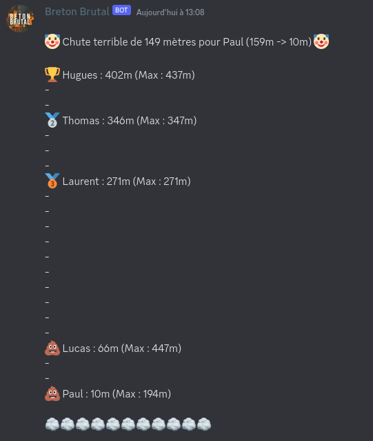
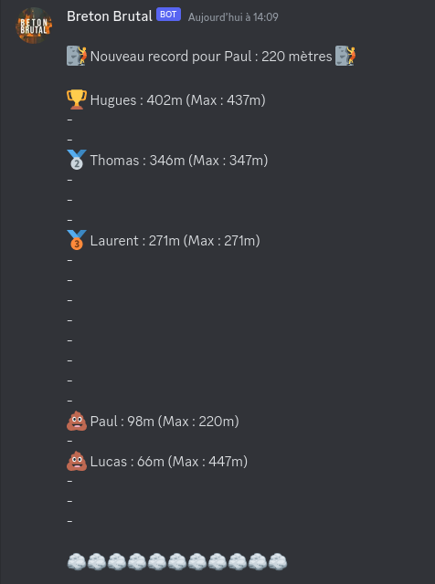

### BOTON BRUTAL

**[Changelog](CHANGELOG.md)**     

Ce projet est séparé en 4 parties :  

## OCR
Un script python lancé côté client qui vient capturer la fenêtre Beton Brutal à intervalle régulier, crop la zone affichant la hauteur, passer un OCR sur la hauteur affichée et enregistrer la hauteur actuelle en l'envoyant à l'API  
 

    

*Optical Character Recognition*

 

## API
Une API Flask hébergée en ligne qui stocke la hauteur de tous les participants. Une route permet d'obtenir la hauteur max et actuelle de tous les participants, et une autre permet de mettre à jour la hauteur d'un utilisateur. À chaque mise à jour de la hauteur client, l'API vient déterminer si la hauteur est un nouveau record ou alors une chute.     

## Bot Discord

 Un bot discord qui permet aux membres du serveur de taper l'API sans avoir à faire de requêtes (pour récuperer la hauteur d'une ou plusieurs personnes) et qui envoie une notification à tout le monde en cas de chute importante ou de record.   
 

    

*Chute d'un joueur*

 

    

*Nouveau record d'un joueur*

 

    

*Accès à l'API*

## Courbes
